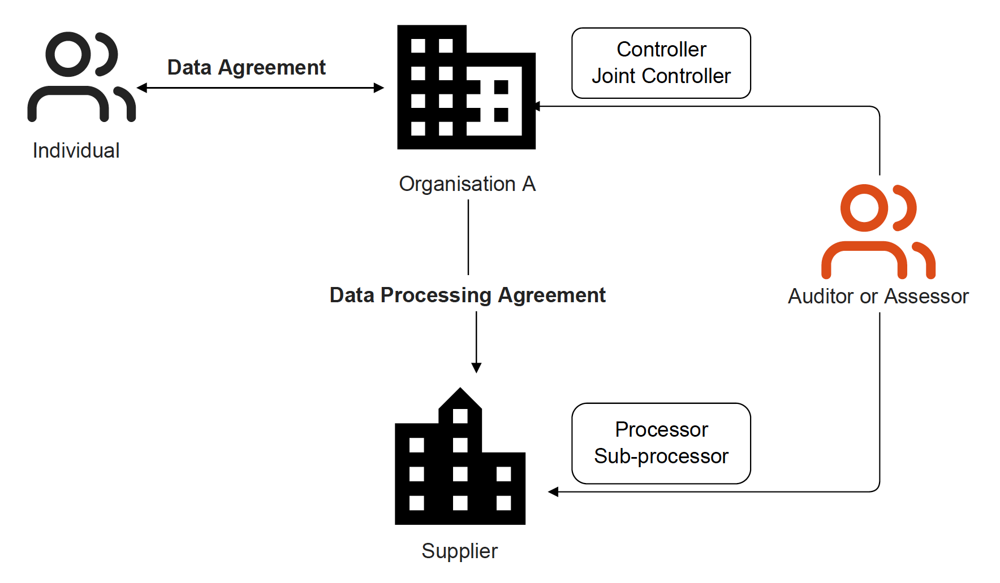
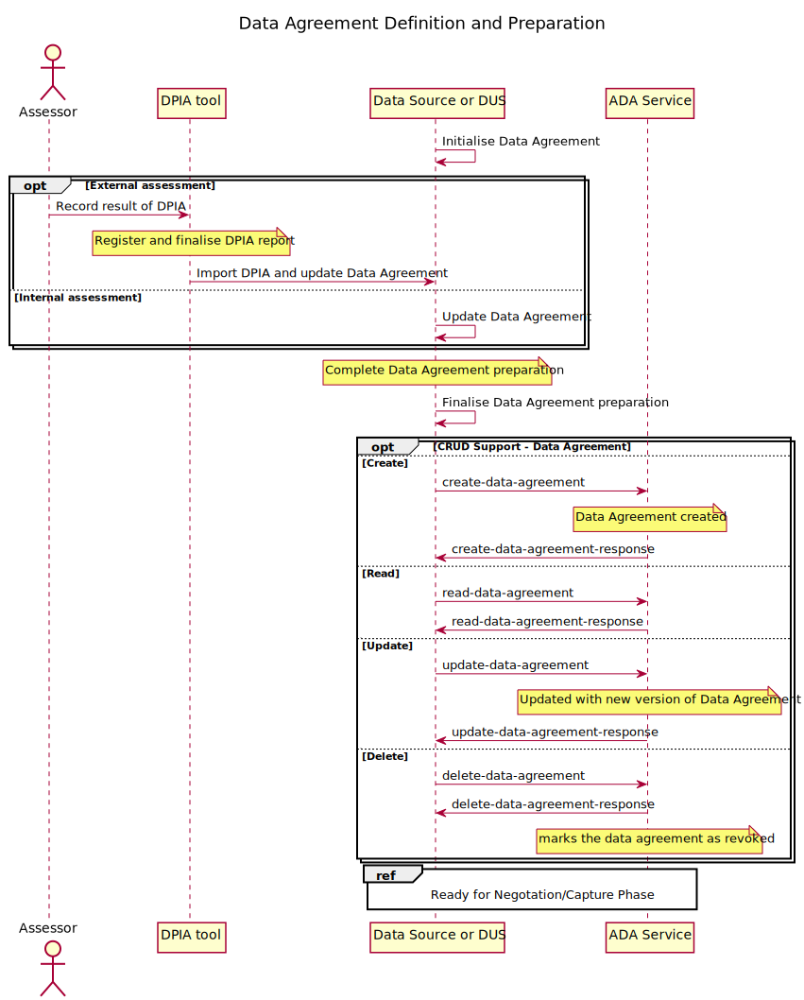
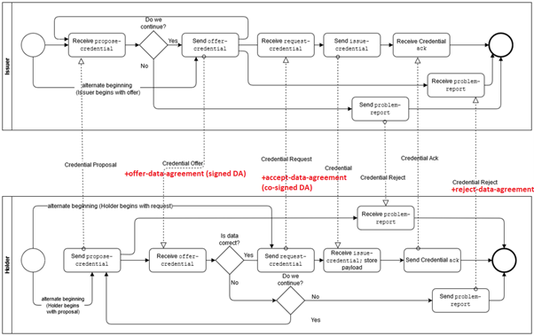
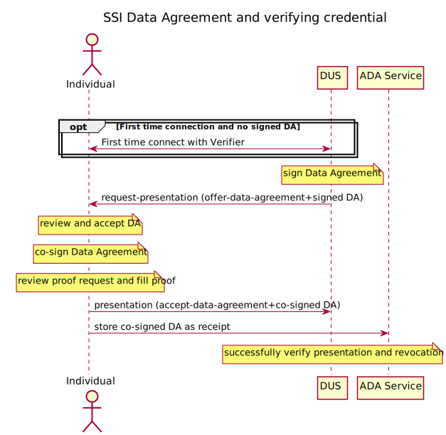
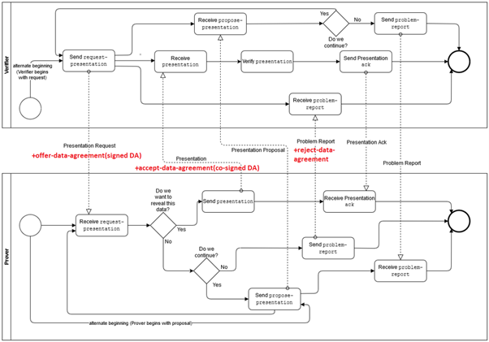
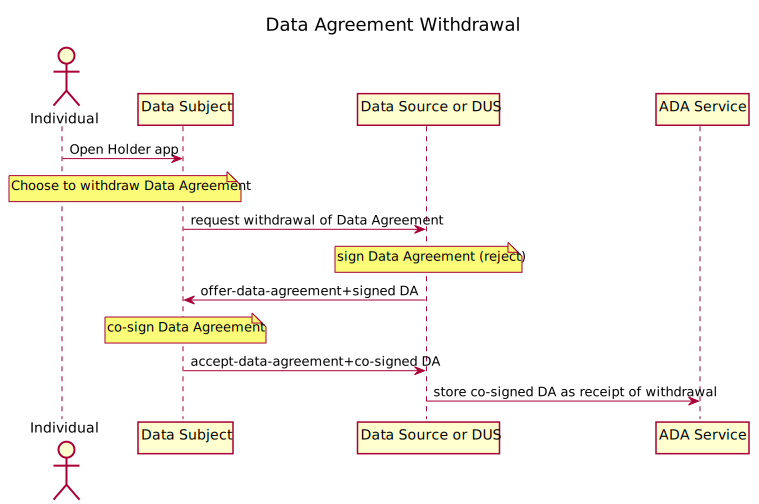

# Data Agreement Specification

## Abstract

A Data Agreement records the conditions for an organization to process personal data in accordance with privacy regulation (e.g. GDPR) captured in a signed receipt given to the individual. To automate creation of the record and increase the trust assurance a Data Protection Impact Assessment may be used to populate the record. 

## Status of This Document

Version 2.1

## Authors
Mr. Jan Linquist (Linaltec, Sweden)  
Ms. Lotta Lundin (iGrant.io, Sweden)  
Mr. Lal Chandran (iGrant.io, Sweden)

## Contributors and Reviwers
Mr. George Padayatti (iGrant.io, Sweden)  
Dr. David Goodman (iGrant.io, Sweden)  
Mr. Pekka Lampelto (PrivacyAnt, Finland)

## Table of contents

- [1.0 Introduction](#10-introduction)
  * [1.1. Abbreviations](#11-abbreviations)
  * [1.2. Data Agreement lifecycle actors](#12-data-agreement-lifecycle-actors)
  * [1.3. Data exchange agreements landscape](#13-data-exchange-agreements-landscape)
    + [1.3.1. Agreement between an individual and an organisation](#131-agreement-between-an-individual-and-an-organisation)
    + [1.3.2. Agreement between two organisations](#132-agreement-between-two-organisations)
  * [1.4. Data Protection Impact Assessment (DPIA)](#14-data-protection-impact-assessment--dpia-)
- [2. Data Agreement functional overview](#2-data-agreement-functional-overview)
  * [2.1. Data Agreement Lifecycle](#21-data-agreement-lifecycle)
  * [2.2. Use Cases](#22-use-cases)
  * [2.3. Sequence diagrams](#23-sequence-diagrams)
    + [2.3.1. Definition and Preparation phases](#231-definition-and-preparation-phases)
    + [2.3.2. Negotiation/Capture phase](#232-negotiation-capture-phase)
      - [2.3.2.1. Issuing credentials (Data Source)](#2321-issuing-credentials--data-source-)
      - [2.3.2.2. Verifying credential (Data Using Service)](#2322-verifying-credential--data-using-service-)
      - [2.3.2.3. Termination](#2323-termination)
    + [2.3.4. Proof](#234-proof)
- [3. References](#3-references)
- [Appendix A: Data Agreement schema](#appendix-a--data-agreement-schema)
- [Appendix B: DPIA (Risk Assessment)](#appendix-b--dpia--risk-assessment-)
- [Appendix C: Standards Input](#appendix-c--standards-input)
  * [Kantara Schema Reference](#kantara-schema-reference)
  * [ISO Standards](#iso-standards)

# 1.0 Introduction

This specification describes how a Data Agreement between an organisation and individual is managed in order to capture, in a receipt, the conditions of processing of personal data. The receipt acts as evidence and demonstrates a higher level of accountability and is based on standard schemas. The accountability is further enhanced by directly integrating the Data Agreement with the input from a risk assessment, e.g. Data Protection Impact Assessment.

In order to create the Data Agreement, and the resulting receipt as proof, a number of steps are required from different actors. This document describes these steps involved and is described as part of a Data Agreement lifecycle.

This specification is published together with an Interface Specification [1] and a DID Method Specification [2]. For details of the DID Method and Interface Specification please refer to these reference documents.The communication between the actors will be based on DIDComm. 

This chapter provides an introduction to Data Agreement and elaborates on the concepts and terminology included in any kind of personal data usage by an organisation.

Chapter 2 provides a functional overview of Data Agreements. It also describes the interworking of various actors in the Data Agreement lifecycle. 

Chapter 3 provides a list of references.

The Appendix provides additional details that includes Data Agreement Schema (Appendix A), how a DPIA report maps to a Data Agreement (Appendix B) and details on the various input standards used in the proposed Data Agreement Schema including the Kantara Consent Notice, ISO standards etc (Appendix C). 

## 1.1. Abbreviations

| Abbr  	| Expanded form            	                     |
|:------	|:-------------------------------------------------|
| ADA  	| Automated Data Agreements                        |
| CRUD 	| Create / Read / Update / Delete                  |
| DA      | Data Agreement (Introduced in this specification)| 
| DID     | Decentralized Identifier (according to W3C)      |
| DPIA    | Data Protection Impact Assessment                | | DS      | Data Source                                      | 
| DUS     | Data Using Service                               | 
| EEA     | European Economic Area                           | 
| EU      | European Union                                   | 
| GDPR    | General Data Protection Regulation               | 
| ISO     | International Organization for Standardization   | 
| JSON    | JavaScript Object Notation                       | 
| SDK     | Software Development Kit                         | 
| SSI     | Self Sovereign Identity                          | 
| ToIP    | Trust over Internet Protocol                     | 
| UC      | Use case                                         | 
| VC      | Verifiable credentials                           | 
| W3C     | World wide web consortium                        | 

## 1.2. Data Agreement lifecycle actors

These actors are involved in the Data Agreement lifecycle.

*   a **Data Source**, the organisation collecting private data, (typically a data controller).  [SSI: Issuer]
*   a **Data Subject** or **Individual**. [SSI: Holder]
*   a **Data Using Service (DUS)**, an organisation processing personal data from one or more data sources to deliver a service. [SSI: Verifier]
*   an **Assessor** reviews the practices of an organisation**, **conducts a DPIA and drafts data agreements and inter-company agreements for third parties.
*   an **Auditor** may be called in to review the data agreements and ensure they are in place in case of data breaches or regular inspection. 

In addition to these actors to better understand the interworking, these nodes are relevant.

*   **Assessment Platform** or **DPIA Tool** is used by Assessor to create reports and populate Data Agreements.
*   **ADA Service** represents the microservices that can be plugged into any service provider wishing to adopt ADA services.

## 1.3. Data exchange agreements landscape 

This chapter introduces various agreements and relationships that exist between organisations and individuals, depending on their roles in the personal data usage scenarios in a personal data economy. The various agreements involved can be classified into two broad categories:.

1. Agreement between an individual and an organisation
2. Agreement between two organisations

This specification focuses on agreement between an individual and an organisation; the agreement between two organisations is not within the scope of this specification and is mentioned here for the sake of completion. 

### 1.3.1. Agreement between an individual and an organisation

This is an agreement between organisations and individuals in the use of personal data. We refer to this as the “Data Agreement” which can have any of the legal basis that is outlined as per data protection law or regulation, such as the GDPR. The agreement with individuals could be with a  Data Source (issuer) or a Data Using Service. 

The focus of this specification is on the Data Agreement, how it is defined, prepared by an organisation wishing to use personal data, how it is negotiated with an individual and finally how an auditor is able to audit the data agreement involved in a data transaction. 

### 1.3.2. Agreement between two organisations 

There can be two forms of agreements between two organisations. 

The first form of agreement is between organisations where one organisation acts as a Data Source and the other as Data Using Service. In this case, both organisations share the role as data controller and are responsible for managing their compliance requirements. They may have made their own privacy risk assessment, documented in a data protection impact assessment (DPIA) report, and concluded whether any additional mitigation effort was required. This agreement is referred to as **Data Disclosure Agreement**, which, though not yet standardised, captures the agreement between two organisations on how data is shared and what obligation each party has. This can be realised as a contract or in terms of use. The individual (data subject) is engaged with both organisations. For each organisation, there exists a **Data Agreement **with an associated privacy policy that explains the purpose of processing personal data, what personal data is collected, data subject rights, etc.

 

The second form of an agreement in this category is between an organisation and their suppliers as illustrated below. 

Here, there is a vertical relationship between an organisation A as a data controller and their suppliers as  data processors or sub-processors. For a higher level of accountability between these organisations,  a **Data Processing Agreement** is set up, which lays out what routines are required to be in place: for example, data processor’s obligations  in case of data breaches or how rights of the data subject, such as access rights, are supported, among other policies and routines. An auditor should also be able to inspect an organisation, and use the data processing agreement as reference during the inspection.

As depicted in the diagram above, the data agreement with the individual is bound to the top of the hierarchy, i.e. the data controller or organisation.

## 1.4.	Data Protection Impact Assessment (DPIA)

A Data Protection Impact Assessment (DPIA) is a structured process where  an organisation can identify and minimise the data protection risks involved in the use of personal data. It ensures that an organisation is compliant to data regulations, such as the GDPR. 

Article 35 of the GDPR requires organisations to conduct DPIAs, especially when the processing is likely to result in high risk to the rights and freedoms of natural persons in the case of extensive use of new technologies and when sensitive personal data is being processed (e.g. health-related data). Organisations can also conduct DPIAs voluntarily, even if the processing does not meet the requirement criteria set out in the GDPR. 

Some EU Member State data protection authorities, such as the Finnish data protection ombudsman, have recommended using dataflow maps when conducting DPIAs. Dataflow maps visualize the flows of personal data across systems, organisations, and jurisdictions, and provide a good overview of the nature and scope of the processing and identify risks.

Appendix B outlines how a DPIA report can map to a Data Agreement. By integrating the DPIA into the lifecycle of the Data Agreement an organisation can demonstrate how the privacy requirements of accountability, transparency, data sharing and retention procedures are fulfilled. If the DPIA report is part of an online tool it is possible to continuously monitor an organisation's data flows and ensure any internal changes are reflected in the Data Agreement.

# 2. Data Agreement functional overview

This section provides a functional overview of the Data Agreement and is broken down into:

* Data Agreement lifecycle
* Applicable use cases
*   Overview of how the actors interwork

## 2.1. Data Agreement Lifecycle

The Data Agreement Lifecycle has 4 main phases as described below:

1. **Definition**: In this phase, an authority adapts the data agreement schema to a particular industry and/or sector specific data usage as a template. This can then be used by any organisation (Data source or Data Using Service) for a particular data usage purpose. 
2. **Preparation**: In this phase, an organisation uses an existing data usage template and prepares it to be published towards the individuals. This could be based on a DPIA and could be for internal use of data or for data exchange to a Data Using Service. Once the Data Agreement is prepared,any changes identified from a subsequent DPIA shall update the Data Agreement and go through a new preparation process. When an agreement is updated or terminated, the individuals are notified and a record is created. 
3. **Negotiation/Capture**: In this phase, an individual reviews the Data Agreement and,  once agreed, it is captured in a Data Agreement *record* by the organisation and the individual is given a Data Agreement *receipt* as evidence of the agreement. The Data Agreement *receipt* can be used as proof for the data transaction that occurred. This allows an auditor to check and ensure records are in place to process the individual's personal data. When the agreement is terminated and is no longer applicable towards an individual, a new record is created. The termination can be due to the service period being completed or an individual requests to revoke the agreement. The record of the termination allows an auditor to inspect personal data that is not used. If an individual requests to be forgotten when terminating a service it shall be clearly indicated.
4. **Proof**: An organisation is able to demonstrate a valid Data Agreement *record* for performing a data exchange with an individual. This allows an auditor to check and ensure records are in place to process the individual's personal data.

How each actor is involved in the different phases can be found in this table.

<table>
  <tr>
   <td><strong>Actors</strong>
   </td>
   <td><strong>Definition</strong>
   </td>
   <td><strong>Preparation</strong>
   </td>
   <td><strong>Capture</strong>
   </td>
   <td><strong>Proof</strong>
   </td>
  </tr>
  <tr>
   <td><strong>ADA Service</strong>
   </td>
   <td>X
   </td>
   <td>X
   </td>
   <td>X
   </td>
   <td>X
   </td>
  </tr>
  <tr>
   <td><strong>Individual or  Data Subject</strong>
   </td>
   <td>
   </td>
   <td>
   </td>
   <td>X
   </td>
   <td>X
   </td>
  </tr>
  <tr>
   <td><strong>Data Source or  Data Using Service</strong>
   </td>
   <td>X
   </td>
   <td>X
   </td>
   <td>X
   </td>
   <td>X
   </td>
  </tr>
  <tr>
   <td><strong>Assessor or a DPIA tool</strong>
   </td>
   <td>X
   </td>
   <td>X
   </td>
   <td>
   </td>
   <td>
   </td>
  </tr>
  <tr>
   <td><strong>Auditor</strong>
   </td>
   <td>
   </td>
   <td>
   </td>
   <td>
   </td>
   <td>X
   </td>
  </tr>
</table>

## 2.2. Use Cases

These are the use cases covered by this specification. A mapping between the use cases and lifecycle phase can help map to the involved actors described in the previous section.

<table>
  <tr>
   <td><strong>#</strong>
   </td>
   <td><strong>Lifecycle Phase</strong>
   </td>
   <td><strong>Use Case</strong>
   </td>
  </tr>
  <tr>
   <td>1
   </td>
   <td rowspan="2" >Definition
   </td>
   <td>Create template Data Agreement for both human and machine readable formats
   </td>
  </tr>
  <tr>
   <td>2
   </td>
   <td>Update Data Agreement based on changes on  assessment (DPIA)
   </td>
  </tr>
  <tr>
   <td>3
   </td>
   <td rowspan="2" >Preparation
   </td>
   <td>Prepare Data Agreement based on an assessment (DPIA)
   </td>
  </tr>
  <tr>
   <td>4
   </td>
   <td>Update Data Agreement based on changes on  assessment (DPIA)
   </td>
  </tr>
  <tr>
   <td>5
   </td>
   <td rowspan="2" >Capture
   </td>
   <td>Countersign a Data Agreement and capture Data Agreement receipt in negotiation/capture phase
   </td>
  </tr>
  <tr>
   <td>6
   </td>
   <td>Data agreement revoked/expired
   </td>
  </tr>
  <tr>
   <td>7
   </td>
   <td>Proof
   </td>
   <td>External audit of Data Agreement 
   </td>
  </tr>
</table>

## 2.3. Sequence diagrams

### 2.3.1. Definition and Preparation phases

“Definition” and “Preparation” phases of the Data Agreements lifecycle have the following functions which can be seen in the sequence diagram.

1. Populate the Data Agreement. This could be based on a DPIA or a self evaluation.  This calls the CRUD (Create/Read/Update/Delete) operations on the Data Agreement(s).

2. Publish/unpublish Data Agreement(s) towards deployments by ADA Service. When it is published, it's available towards the individual.

### 2.3.2. Negotiation/Capture phase

In this phase, an Individual can Sign and Revoke (Opt-out) a data agreement which results in a data agreement receipt. The signing can be performed using a unique identifier during the creation of a verifiable credential or when performing proof presentation for example when showing proof of identity. Typically the proof may be expected to be the first step to connect with an organization.

#### 2.3.2.1. Issuing credentials (Data Source)

The below sequence diagram shows how the steps of issuing a credential can be used to present and agree on the Data Agreement. The Data Agreement will be presented as an offer and once accepted a receipt is created. The sequence of actions are:

1. A Data Source offers to issue data and adds a reference to a signed Data Agreement.
2. Once the user agrees to the data offer and accepts it, the agreement is counter signed and a receipt is created. 

The following diagram is from [Aries 0036 Issue Credential](https://github.com/hyperledger/aries-rfcs/tree/master/features/0036-issue-credential) and the text in red represents how a Data Agreement is processed as part of a credentia offer when it is accepted or rejected.

#### 2.3.2.2. Verifying credential (Data Using Service)

The below sequence diagram shows the Data Agreement flows for a verifier or Data Using Service, when requesting data to be shared by the individual. The sequence of actions are:

1. A Data Using Service makes a request for proof and adds a reference to a signed Data Agreement.
2. Once the user agrees to the data offer and accepts it, the agreement is counter signed and a receipt is created. 

The following diagram is taken from [Aries 0037 Presentation Proof](https://github.com/hyperledger/aries-rfcs/tree/master/features/0037-present-proof ) and the text in red represents how the Data Agreement is processed in the offer and accepted with the option to reject.

#### 2.3.2.3. Termination

The Data Agreement may be terminated in a number of ways. Here are a few of the scenarios:

1. Data Agreement expired and the service is no longer applicable
2. Updated Data Agreement with new purpose or changes to collected pii categories
3. Individual requests to terminate the service before expiration date
4. Individual requests not only terminate but have their personal data erased

Note the erasure may come after termination of the Data Agreement.

The following diagram is the case for individual requests to terminate scenario 3, individual requests termination.

### 2.3.4. Proof

In accordance with GDPR Art. 30, Records of processing activities, a Data Controller (Data Source and DUS) shall record processing activities under its responsibilities. The records shall be available to the individual to inspect in the form of a receipt and provide means of an audit. An audit can be initiated due to the following reasons:

1. Complaint by Data Subject
2. Review of Data Source or Data Using Service record logs

The complaint by Data Subject will include a copy of the Data Agreement receipt and explanation of the violation by Data Source or DUS.

The following sequence is the approach taken when the auditor reviews implementation of Data Agreement capture and withdrawal. If the auditor lacks the software to perform the read then a dashboard access is provided by the Data Source or DUS. In case of a Data Subject complaint a reference to the original Data Agreement is shared with the Auditor so the Auditor can perform the same verification.

# 3. References

[1]  [Data Agreement Interface Specification](https://github.com/decentralised-dataexchange/automated-data-agreements/blob/main/docs/interface_specification.md)

[2]	  [Data Agreement - DID Method Specification](https://github.com/decentralised-dataexchange/automated-data-agreements/blob/main/docs/did-spec.md)

[3]	 [Kantara Consent Receipt Specification](https://kantarainitiative.org/file-downloads/consent-receipt-specification-v1-1-0/) 

[4]	 ISO/IEC 29184: 2020: Information Technology - Online Privacy Notices and Consent (Published, available at [https://www.iso.org/standard/70331.html](https://www.iso.org/standard/70331.html))

[5]	 ISO/IEC TS 27560 — Privacy technologies — Consent record information structure (Not published yet)

# Appendix A: Data Agreement schema

This section describes the content of the Data Agreement. The schema is based on Kantara Consent Notice [3], as well as ongoing ISO standardization under ISO project 27560, Consent record information structure. Note ISO/IEC TS 27560 [5] is not yet published as it is only referred to by field names but the input requirements for 27560 is the published ISO standards 29184, Information technology - Online privacy notice and consent [4].

Table below captures, at a high level, the various attributes to be collected when recording and creating Data Agreement receipts. This is based on analysis of the DPIA reporting and the various standards analysed. 

<table>
  <tr>
   <td>
<ul>

<li>Privacy policy url
</li>
</ul>
   </td>
   <td>
   </td>
  </tr>
  <tr>
   <td>
<ul>

<li>Purpose(s)
</li>
</ul>
   </td>
   <td> 
<ul>
 
<li>Purpose - describe (highest risk first)
 
<li>pii categories related to purpose (what is collected)
 
<li>Service name applicable for purpose
</li> 
</ul>
   </td>
  </tr>
  <tr>
   <td>
<ul>

<li>Processing
</li>
</ul>
   </td>
   <td> 
<ul>
 
<li>Collection method (directly, indirectly, observed, inferred, etc.)
 
<li>Method of use (as is, after processing, combined, automated decision making)
 
<li>Retention (how long data kept)
 
<li>Jurisdiction data stored
 
<li>Transfer to which third parties  
<ul>
  
<li>Jurisdiction
  
<li>Purpose of transfer
</li>  
</ul>
 
<li>Withdrawal option (link to withdraw)
 
<li>Optional: Code of conduct
 
<li>Optional: Assessment performed
 
<li>List of sensitive pii categories
</li> 
</ul>
   </td>
  </tr>
  <tr>
   <td>
<ul>

<li>Record
</li>
</ul>
   </td>
   <td> 
<ul>
 
<li>Reference to Data Controller
 
<li>Reference to individual
 
<li>Consent timestamp
 
<li>Consent duration (how long valid)
 
<li>Form of consent (explicit, implicit, etc)
 
<li>Termination timestamp
</li> 
</ul>
   </td>
  </tr>
</table>

NOTE: For deeper analysis of the DPIA mapping exercise refer to this [link](https://docs.google.com/spreadsheets/d/1_XHknzKBMxdcxCqP9AGdPYq7nYli5LvKyUkHPs2qyZA/edit?usp=sharing).

The following table lists the required fields in the Data Agreement. The attribute names are from ISO 27560 and for better insight the Kantara 1.1 fields are included.

<table>
  <tr>
   <td><strong>Data element identifier</strong>
   </td>
   <td><strong>Kantara 1.1 fields</strong>
   </td>
   <td><strong>Description</strong>
   </td>
   <td><strong>Required</strong>
   </td>
  </tr>
  <tr>
   <td colspan="4" ><em>Record metadata </em>
   </td>
  </tr>
  <tr>
   <td>schema_version
   </td>
   <td>version
   </td>
   <td>An identifier for the implementation documentation to which the record conforms.
   </td>
   <td>Required
   </td>
  </tr>
  <tr>
   <td>consent_record_id
   </td>
   <td>consentReceiptID
   </td>
   <td>A unique number for each consent record.
   </td>
   <td>Required
   </td>
  </tr>
  <tr>
   <td colspan="4" ><em>PII processing </em>
   </td>
  </tr>
  <tr>
   <td>notice_timestamp
   </td>
   <td>consentTimestamp
   </td>
   <td>Date and time that the consent was obtained.

The number of seconds since 1970-01-01 00:00:00 UTC.
   </td>
   <td>Required
   </td>
  </tr>
  <tr>
   <td>privacy_notice_URL
   </td>
   <td>policyURL
   </td>
   <td>A link to the PII controller’s privacy notice and applicable terms of use in effect when the consent was obtained, and the receipt was issued. If a privacy policy changes, the link SHOULD continue to point to the old policy until there is evidence of an updated consent from the PII principal.
   </td>
   <td>Required
   </td>
  </tr>
  <tr>
   <td>language
   </td>
   <td>language
   </td>
   <td>Language of notice and interface related to consent.
   </td>
   <td>Required
   </td>
  </tr>
  <tr>
   <td>purposes
   </td>
   <td>purposes
   </td>
   <td>An implicit or explicit reference to an array that contains one or more items where each item represents one Purpose.
   </td>
   <td>Required
   </td>
  </tr>
  <tr>
   <td>purpose_category
   </td>
   <td>purposeCategory
   </td>
   <td>A broad category providing further description and context to the specified purpose for PII processing.
   </td>
   <td>Optional
   </td>
  </tr>
  <tr>
   <td>pii_categories
   </td>
   <td>piiCategory
   </td>
   <td>An explicit list of PII categories to be processed for the specified purpose. The categories shall be defined using language meaningful to the users and consistent with the purposes of processing. The PII categories may be represented implicitly, across all consent records of this type in the consent record handling system
   </td>
   <td>Required
   </td>
  </tr>
  <tr>
   <td>services
   </td>
   <td>services
   </td>
   <td>An implicit or explicit reference to an array that contains one or more items where each item represents one Service.
   </td>
   <td>Required
   </td>
  </tr>
  <tr>
   <td>service
   </td>
   <td>service
   </td>
   <td>A service or group of services being provided for which PII is collected, represented by the name of the service for which consent for the collection, use, and disclosure of PII is being provided.
   </td>
   <td>Required
   </td>
  </tr>
  <tr>
   <td>pii_controllers
   </td>
   <td>piiControllers
   </td>
   <td>An array that contains one or more party_identifier values where each identifier represents one PII controller. A corresponding party identification structure shall exist in the party identification section for each array element
   </td>
   <td>Required
   </td>
  </tr>
  <tr>
   <td>collection_method
   </td>
   <td>collectionMethod
   </td>
   <td>Clear explanations of the PII collection methods being used, along with information about any risks associated with particular PII collection methods.
   </td>
   <td>Required
   </td>
  </tr>
  <tr>
   <td>method_of_use
   </td>
   <td>
   </td>
   <td>How the PII will be used

If the PII principal was informed of the processing operations employed by the PII controller(s) to process the PII, under the auspices of this consent, then that information may be recorded as part of the consent record.
   </td>
   <td>Required
   </td>
  </tr>
  <tr>
   <td>jurisdiction
   </td>
   <td>jurisdiction
   </td>
   <td>The geo-location(s) where PII will be stored and processed, and the legal jurisdiction(s) that govern the handling of the data.
   </td>
   <td>Required
   </td>
  </tr>
  <tr>
   <td>third_party_name
   </td>
   <td>thirdPartyName
   </td>
   <td>The name or names of the third party to which the PII processor may disclose the PII.
   </td>
   <td>Required
   </td>
  </tr>
  <tr>
   <td>withdrawal
   </td>
   <td>
   </td>
   <td>Indicates information or link on how/where the PII principal can withdraw this consent.
   </td>
   <td>Required
   </td>
  </tr>
  <tr>
   <td>code_of_conduct
   </td>
   <td>
   </td>
   <td>The PII controller may follow a code of conduct which sets the proper application of privacy regulation taking into account specific features within a sector. The code of conduct shall reference the name of the code of conduct and with a public accessible reference.
   </td>
   <td>Optional
   </td>
  </tr>
  <tr>
   <td>assessment
   </td>
   <td>
   </td>
   <td>The PII controller may perform a privacy assessment in order to determine privacy risks and potential impacts to non-compliance of the PII principals. The assessment instance is a reference to the latest assessment and shall include assessment name (e.g. PIA or DPIA), when assessment was signed off and reference to the assessment firm. If certification is provided for the assessment it shall be included.
   </td>
   <td>Optional
   </td>
  </tr>
  <tr>
   <td>sensitive_pii_categories
   </td>
   <td>spiCat
   </td>
   <td>A PII controller may explicitly note some PII categories that are considered sensitive where this has an impact on the consent or its use for the specified purpose or in other contexts such as the sharing with other parties.
   </td>
   <td>Optional
   </td>
  </tr>
  <tr>
   <td colspan="4" ><em>Party identification </em>
   </td>
  </tr>
  <tr>
   <td>party_id
   </td>
   <td>
   </td>
   <td>An unambiguous identifier indicating the party within the record.
   </td>
   <td>Mandatory
   </td>
  </tr>
  <tr>
   <td>party_postal
   </td>
   <td>address
   </td>
   <td>Contact information in the form of postal address
   </td>
   <td>Optional
   </td>
  </tr>
  <tr>
   <td>party_email
   </td>
   <td>email
   </td>
   <td>Contact information in the form of email address
   </td>
   <td>Optional
   </td>
  </tr>
  <tr>
   <td>party_url
   </td>
   <td>piiControllerURL
   </td>
   <td>Contact information in the form of web site address
   </td>
   <td>Optional
   </td>
  </tr>
  <tr>
   <td>party_phone
   </td>
   <td>phone
   </td>
   <td>Contact information in the form of phone number
   </td>
   <td>Optional
   </td>
  </tr>
  <tr>
   <td><em>Consent section contents</em>
   </td>
   <td>
   </td>
   <td>
   </td>
   <td>
   </td>
  </tr>
  <tr>
   <td>consent_timestamp
   </td>
   <td>
   </td>
   <td>Date and time that the consent was obtained.

The number of seconds since 1970-01-01 00:00:00 UTC.
   </td>
   <td>Required
   </td>
  </tr>
  <tr>
   <td>consent_duration
   </td>
   <td>
   </td>
   <td>The period from the date and time when the consent was given to the date and time of its termination.
   </td>
   <td>Optional
   </td>
  </tr>
  <tr>
   <td>pii_principal_id
   </td>
   <td>piiPrincipalId
   </td>
   <td>An identifier provided by or associated with the Principal. E.g., email address, claim, defined/namespace or pseudonymized identifier.
   </td>
   <td>Required
   </td>
  </tr>
  <tr>
   <td>consent_type
   </td>
   <td>consentType
   </td>
   <td>The PII controller shall indicate the consents type used to disclose privacy notice with the PII principal.
   </td>
   <td>Required
   </td>
  </tr>
  <tr>
   <td>termination
   </td>
   <td>termination
   </td>
   <td>Indicates that the consent referred to in the record has been terminated by the specified condition or event. Termination of consent indicates its unsuitability to be used as continued basis for the processing of PII.
   </td>
   <td>Optional
   </td>
  </tr>
  <tr>
   <td>retention
   </td>
   <td>
   </td>
   <td>The amount of time a pii data is kept after which they are removed.
   </td>
   <td>Optional (new)
   </td>
  </tr>
  <tr>
   <td>expiration
   </td>
   <td>
   </td>
   <td>How long a consent is valid for before expiring
   </td>
   <td>Optional (new)
   </td>
  </tr>
</table>

# Appendix B: DPIA (Risk Assessment)

This appendix describes how a DPIA reports maps to the Data Agreement. For deeper analysis of the DPIA mapping exercise refer to this [link](https://docs.google.com/spreadsheets/d/1_XHknzKBMxdcxCqP9AGdPYq7nYli5LvKyUkHPs2qyZA/edit#gid=0). DPIA reports are typically composed of the following  sections:

1. Overview
2. Scope
3. Roles and responsibilities
4. Processing Overview
5. Scope of Processing
6. Context of Processing
7. Stakeholder Engagement (Data Subject)
8. Compliance with data protection law and other regulatory guidance
9. Identify and Assess Risks
10. Identify measures to Reduce Risks
11. Sign off and Record Outcomes

The key areas for input to the Data Agreement are Roles and Responsibilities, Scope of Processing and Context of Processing. The Context of Processing establishes the lawful basis for processing personal data. The Roles and Responsibilities lists all involved entities like data controllers, data processors and sub-processors.

The Scope of Processing section looks into private data processing in more detail. Typically this sections covers the following:

1. Data Subject Categories
2. Data Types
3. Data Collected/Processed
4. Data Retention
5. Parties Access/Use (member/role/access)
6. Personal Data (attribute level, type, collection activity, frequency)

## Data Agreement mapping from DPIA

The following table provides a mapping between the DPIA report and the Data Agreement. 

<table>
  <tr>
   <td><strong>Data Agreement</strong>
   </td>
   <td><strong>DPIA</strong>
   </td>
  </tr>
  <tr>
   <td colspan="2" ><em>Purpose(s)</em>
   </td>
  </tr>
  <tr>
   <td>
    Purpose - describe (highest risk first)
   </td>
   <td>8. Compliance with data protection law and other regulatory guidance

+

9. Identify measures to Reduce Risks
   </td>
  </tr>
  <tr>
   <td>
    pii categories related to purpose (what is collected)
   </td>
   <td>5.6. Personal Data (attribute level, type, collection activity, frequency)
   </td>
  </tr>
  <tr>
   <td>
    Service name applicable for purpose
   </td>
   <td>2. Scope
   </td>
  </tr>
  <tr>
   <td colspan="2" ><em>Processing</em>
   </td>
  </tr>
  <tr>
   <td>
    Collection method (directly, indirectly, observed, inferred, etc.)
   </td>
   <td>4. Processing Overview
   </td>
  </tr>
  <tr>
   <td>
    Method of use (as is, after processing, combined, automated decision making)
   </td>
   <td>4. Processing Overview

+

5.3 Data Collected/Processed
   </td>
  </tr>
  <tr>
   <td>
    Retention (how long data kept)
   </td>
   <td>5.4. Data Retention
   </td>
  </tr>
  <tr>
   <td>
    Jurisdiction data stored
   </td>
   <td>7. Compliance with data protection law and other regulatory guidance
   </td>
  </tr>
  <tr>
   <td>
    Transfer to which third parties
<ul>

<li>Jurisdiction

<li>Purpose of transfer
</li>
</ul>
   </td>
   <td>5.5. Parties Access/Use (member/role/access)
   </td>
  </tr>
  <tr>
   <td>
    Optional: Assessment performed
   </td>
   <td>10. Sign off and Record Outcomes
   </td>
  </tr>
  <tr>
   <td>
    List of sensitive pii categories
   </td>
   <td>5.6. Personal Data (attribute level, type, collection activity, frequency)
   </td>
  </tr>
</table>

# 

# Appendix C: Standards Input

This section serves as a reference to some of the material that has been used for the development of the Data Agreement schema.

## Kantara Schema Reference

Kantara Consent Receipt Specification v1.1.0

<table>
  <tr>
   <td><strong>Attribute</strong>
   </td>
   <td><strong>Type</strong>
   </td>
   <td><strong>Required</strong>
   </td>
   <td><strong>Description</strong>
   </td>
  </tr>
  <tr>
   <td>version
   </td>
   <td>string
   </td>
   <td>REQUIRED
   </td>
   <td>
   </td>
  </tr>
  <tr>
   <td>jurisdiction
   </td>
   <td>string
   </td>
   <td>REQUIRED
   </td>
   <td>REQUIRED: The jurisdiction(s) applicable to this transaction. This field MUST contain a non-empty string describing the jurisdiction(s).
   </td>
  </tr>
  <tr>
   <td>consentTimeStamp
   </td>
   <td>integer
   </td>
   <td>REQUIRED
   </td>
   <td>REQUIRED: Date and time of the consent transaction. The JSON value MUST be expressed as the number of seconds since 1970-01-01 00:00:00 GMT. ISO 8601 Date and Time Format [ISO 8601] MUST be used for formatting.
   </td>
  </tr>
  <tr>
   <td>collectionMethod
   </td>
   <td>string
   </td>
   <td>REQUIRED
   </td>
   <td>REQUIRED: A description of the method by which consent was obtained. Collection Method is a key field for context and determining what fields MUST be used for the Consent Receipt. This field MUST contain a non-empty string.
   </td>
  </tr>
  <tr>
   <td>consentReceiptID
   </td>
   <td>string
   </td>
   <td>REQUIRED
   </td>
   <td>REQUIRED: A unique number for each Consent Receipt. SHOULD use UUID-4 [RFC 4122]. This field MUST contain a non-empty string.
   </td>
  </tr>
  <tr>
   <td>publicKey
   </td>
   <td>string
   </td>
   <td>OPTIONAL
   </td>
   <td>
   </td>
  </tr>
  <tr>
   <td>language
   </td>
   <td>string
   </td>
   <td>OPTIONAL
   </td>
   <td>
   </td>
  </tr>
  <tr>
   <td>piiPrincipalId
   </td>
   <td>string
   </td>
   <td>REQUIRED
   </td>
   <td>REQUIRED: PII Principal-provided identifier. E.g., email address, claim, defined/namespace. Consent is not possible without an identifier. This field MUST contain a non-empty string.
   </td>
  </tr>
  <tr>
   <td>piiControllers
   </td>
   <td>array
   </td>
   <td>REQUIRED
   </td>
   <td>REQUIRED: Name of the first PII Controller who collects the data. This entity is accountable for compliance with the management of PII. The PII Controller determines the purpose(s) and type(s) of PII processing. There may be more than one PII Controller for the same set(s) of operations performed on the PII, in which case the different PII Controllers SHOULD be listed. For Sensitive PII, the PII Controller MUST be specified with legally required explicit notice to the PII Principal. This field MUST contain a non-empty string.
   </td>
  </tr>
  <tr>
   <td>

item

   </td>
   <td>
   </td>
   <td>
   </td>
   <td>
   </td>
  </tr>
  <tr>
   <td>policyUrl
   </td>
   <td>string
   </td>
   <td>REQUIRED
   </td>
   <td>REQUIRED: A link to the PII Controller’s privacy statement/policy and applicable terms of use in effect when the consent was obtained, and the receipt was issued. If a privacy policy changes, the link SHOULD continue to point to the old policy until there is evidence of an updated consent from the PII Principal. This field MUST contain a non-empty string.
   </td>
  </tr>
  <tr>
   <td>services
   </td>
   <td>array
   </td>
   <td>REQUIRED
   </td>
   <td>REQUIRED: An array that contains one or more items where each item represents one Service. It is only required for the JSON encoding of a Consent Receipt.
   </td>
  </tr>
  <tr>
   <td>    purpose
   </td>
   <td>string
   </td>
   <td>OPTIONAL
   </td>
   <td>OPTIONAL: A short, clear explanation of why the PII is required.
   </td>
  </tr>
  <tr>
   <td>    consentType
   </td>
   <td>string
   </td>
   <td>REQUIRED
   </td>
   <td>REQUIRED: A description of the method by which consent was obtained. Collection Method is a key field for context and determining what fields MUST be used for the Consent Receipt. This field MUST contain a non-empty string.
   </td>
  </tr>
  <tr>
   <td>    purposeCategory
   </td>
   <td>array
   </td>
   <td>REQUIRED
   </td>
   <td>REQUIRED: The reason the PII Controller is collecting the PII. Example Purpose Categories currently in use are available on the Kantara Consent & Information Sharing Work Group (CISWG) Wiki page (https://kantarainitiative.org/confluence/x/74K-BQ). This field MUST contain a non-empty string.
   </td>
  </tr>
  <tr>
   <td>    piiCategory
   </td>
   <td>string
   </td>
   <td>REQUIRED
   </td>
   <td>REQUIRED: A list of defined PII categories. PII Category should reflect the category that will be shared as understood by the PII Principal. More information can be found on the Kantara Consent & Information Sharing Work Group (CISWG) Wiki page. (https://kantarainitiative.org/confluence/x/74K-BQ). This field MUST contain a non-empty string.
   </td>
  </tr>
  <tr>
   <td>    primaryPurpose
   </td>
   <td>boolean
   </td>
   <td>OPTIONAL
   </td>
   <td>OPTIONAL: Indicates if a purpose is part of the core service of the PII Controller. Possible values are TRUE or FALSE.
   </td>
  </tr>
  <tr>
   <td>    termination
   </td>
   <td>string
   </td>
   <td>REQUIRED
   </td>
   <td>REQUIRED: Conditions for the termination of consent. Link to policy defining how consent or purpose is terminated. This field MUST contain a non-empty string.
   </td>
  </tr>
  <tr>
   <td>    thirdPartyDisclosure
   </td>
   <td>boolean
   </td>
   <td>REQUIRED
   </td>
   <td>REQUIRED: Indicates if the PII Controller is disclosing PII to a third party. Possible values are TRUE or FALSE.
   </td>
  </tr>
  <tr>
   <td>sensitivity
   </td>
   <td>boolean
   </td>
   <td>REQUIRED
   </td>
   <td>REQUIRED: Indicates whether the consent interaction contains PII that is designated sensitive or not sensitive. Possible values are TRUE or FALSE. A value of TRUE indicates that data covered by the Consent Receipt is sensitive, or could be interpreted as sensitive, which indicates that there is policy information out-of-band of the Consent Receipt.
   </td>
  </tr>
  <tr>
   <td>spiCat
   </td>
   <td>array
   </td>
   <td>REQUIRED
   </td>
   <td>REQUIRED: A listing of categories where PII data collected is sensitive. The field MUST contain a non-empty string if Sensitive PII is TRUE.
   </td>
  </tr>
</table>

## ISO Standards 

The two ISO standards relevant to Data Agreements are as below.

1. ISO/IEC 29184: 2020: Information Technology - Online Privacy Notices and Consent 

2. ISO/IEC TS 27560 — Privacy technologies — Consent record information structure 

