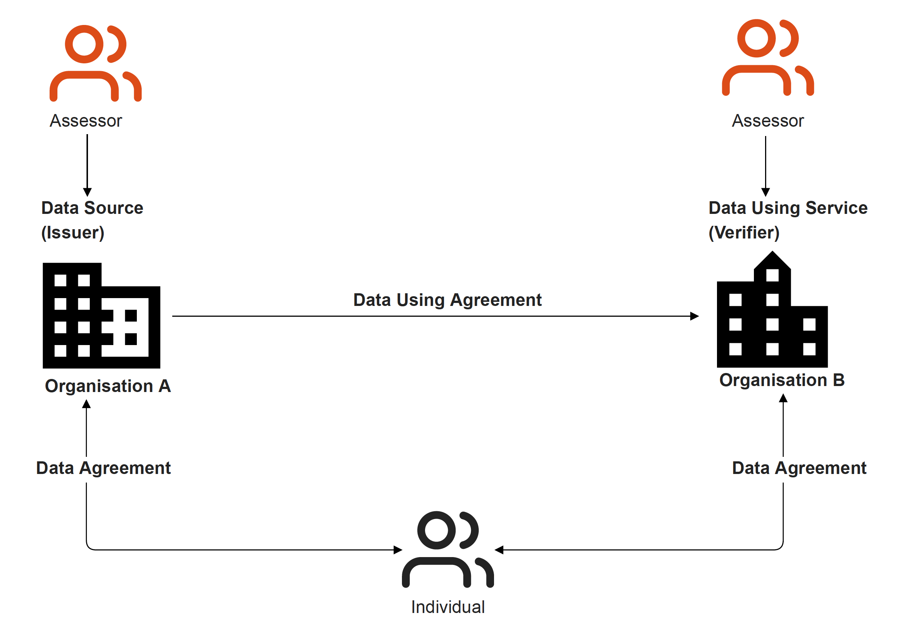
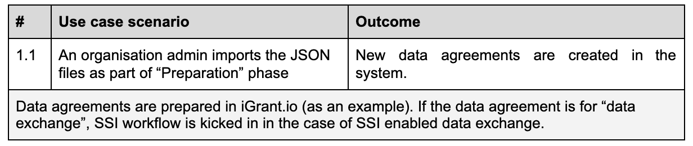
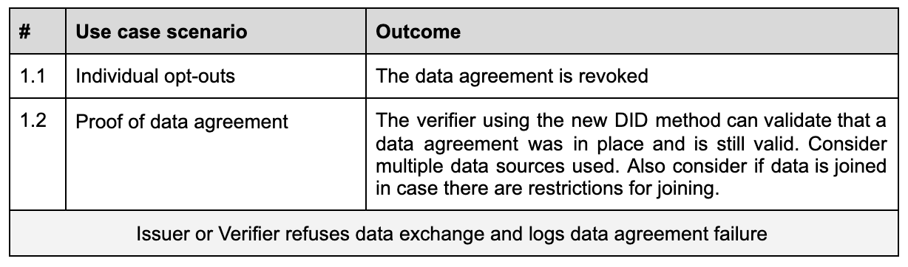
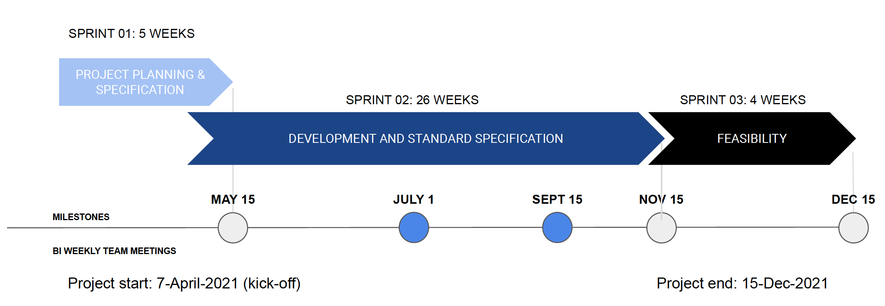

# Functional specification - Automated Data Agreement (ADA)

## Table of contents

- [1.0 Background](#10-background)
  * [1.1 Easing SSI usability and reducing adoption pain points](#11-easing-ssi-usability-and-reducing-adoption-pain-points)
  * [1.2 Actors involved in a data agreement workflow](#12-actors-involved-in-a-data-agreement-workflow)
  * [1.3 Data agreements](#13-data-agreements)
  * [1.4 Data exchange, agreements and compliance landscape](#14-data-exchange-agreements-and-compliance-landscape)
    + [1.4.1   Agreement between two organisations](#141agreement-between-two-organisations)
    + [1.4.2   Agreement between an organisation and their suppliers](#142agreement-between-an-organisation-and-their-suppliers)
  * [1.5  Data Protection Impact Assessment (DPIA)](#15data-protection-impact-assessment-dpia)
  * [1.6  Scope](#16scope)
- [2.0   Problem statement](#20problem-statement)
- [3.0   Solution overview](#30solution-overview)
  * [3.1  Automated data agreement workflow in SSI](#31automated-data-agreement-workflow-in-ssi)
  * [3.2  Delegation/Guardianship data exchange](#32delegationguardianship-data-exchange)
  * [3.3  Architecture](#33architecture)
    + [3.3.1   High-level overview](#331high-level-overview)
    + [3.3.2   Component architecture](#332component-architecture)
  * [3.4 Interfaces and APIs](#34interfaces-and-apis)
    + [3.4.1   Data agreement](#341data-agreement)
    + [3.4.2   Delegated consents](#342delegated-consents)
- [4.0   Business potential](#40business-potential)
- [5.0   Reference use cases](#50reference-use-cases)
  * [5.1  Data agreement use cases](#51data-agreement-use-cases)
    + [5.1.1   UC-01: Download data agreement based on CRUD operations](#511uc-01-download-data-agreement-based-on-crud-operations)
    + [5.1.2   UC-02: Import data agreement to a MyData Operator](#512uc-02-import-data-agreement-to-a-mydata-operator)
    + [5.1.3 UC-03: Auditability of a data exchange](#513-uc-03-auditability-of-a-data-exchange)
    + [5.1.4   UC-04: Active data exchange and proof of data agreement](#514uc-04-active-data-exchange-and-proof-of-data-agreement)
    + [5.1.5   UC-05: Passive data exchange and proof of data agreement](#515uc-05-passive-data-exchange-and-proof-of-data-agreement)
    + [5.1.6   UC-06: Data agreement revoked/expired](#516uc-06--data-agreement-revoked-expired)
    + [5.1.7 UC-07: Metadata search](#517uc-07--metadata-search)
  * [5.2  Delegation/guardianship use cases](#52delegation-guardianship-use-cases)
    + [5.2.1   UC-07: Guardianship setup](#521uc-07--guardianship-setup)
    + [5.2.2   UC-08: Guardianship revoke/expired](#516uc-06-data-agreement-revokedexpired)
- [6.0   Key considerations](#60key-considerations)
  * [6.1  Data agreement compliance](#61data-agreement-compliance)
  * [6.2  Interoperability](#62interoperability)
  * [6.3  Privacy risks](#63privacy-risks)
  * [6.4  Security and auditability](#64security-and-auditability)
- [7.0   Software requirements](#70software-requirements)
  * [7.1  Non-functional requirements](#71non-functional-requirements)
  * [7.2  Functional requirements](#72functional-requirements)
- [8.0   Project plan](#80project-plan)
  * [8.1  Activities/Work packages](#81activities-work-packages)
  * [8.2  Key deliverables](#82key-deliverables)
  * [8.3  Schedule and project phases](#83schedule-and-project-phases)
- [Glossary](#glossary)
- [References](#references) 
- [Appendix A: Data agreement schema](#appendix-a-data-agreement-schema)
- [Appendix B: Data agreement DID method and protocol](#appendix-b-data-agreement-did-method-and-protocol)
  * [DID method](#did-method)
  * [DIDComm protocol](#didcomm-protocol)

# 1.0 Background
Market research firm IDC estimates that 2.3 trillion USD will be spent on digital transformation worldwide in 2023. While a technology like SSI is an effective way to enable digitalisation, it needs to ensure compliance to data regulatory requirements in order for businesses to adopt it. The Data Governance Act is an example of how the EU encourages digitalisation in a privacy-preserving manner. 

This project (also referred to as the ADA) focuses on building key governance elements in the SSI stack that accelerates SSI adoption and aims to remove the regulatory pain points for SSI solution providers within the eSSIF-Lab community and beyond by:

1. Standardising data agreement schemas across SSI solution providers.
1. Developing an open source component that automates the process for data agreement handling that can be linked to the issuance and verification of verifiable credentials. This solution is aligned with data regulatory requirements for data exchange and can be plugged into any existing SSI stack workflow.
1. Addressing delegated data agreements or consents for children and elderly citizens.

Throughout this specification we mean requirements pertaining to the GDPR when referring to regulatory compliance, data protection regulation, regulation, data requirements etc, unless otherwise stated.

## 1.1 Easing SSI usability and reducing adoption pain points

The ADA component reduces the compliance risk for organisations and focuses on enhanced end-user experience and trust, easing the adoption of SSI technology by organisations and accessibility by individuals, by addressing the following aspects:

1. **End-user empowerment:** Giving individuals control over how data pertaining to them is used and allowing them to exercise their rights as data subjects; and in addition enabling organisations to legally re-use that data.
2. **Data usage transparency:** Enabling organisations to be both transparent about their usage of personal data down to the attribute level and compliant with regulation.
3. **Data collection limited to the purpose selected:** Making it safer for both individuals and organisations to share data by limiting the amount of data shared.
4. **Paperless, all digital:** Information can be automatically populated in a form based on data that individuals already have and can be reused. 
5. **Privacy by design:** Apart from contributing to data reuse and adherence to data minimisation requirements, every personal data transaction is independently verifiable with this new solution, significantly reducing the risk of privacy violations. 

## 1.2 Actors involved in a data agreement workflow

These are the actors using ADA services: 

* a **Data Source**, the organisation collecting private data, (typically a data controller).  [SSI: Issuer]
* a **Data Subject** or **Individual**. [SSI: Holder]
* a **Data Using Service**, an organisation processing personal data from one or more data sources to deliver a service. [SSI: Verifier]
* an **Assessor** reviews the practices of an organisation, conducts a DPIA and drafts data agreements and inter-company agreements for third parties.
* an **Auditor** may be called in to review the data agreements and ensure they are in place in case of data breaches or regular inspection. 

## 1.3 Data agreements

In this project, we will refer to three types of data agreements:

* A **Data Agreement** exists between organisations and individuals in the use of personal data. This agreement can have any of the legal basis that is outlined as per any data protection regulation.
* A **Data Using Agreement** is a new term introduced here to capture the agreement between two companies on how data is shared and used, that can be realised as a contract or terms of use.
* A **Data Processing Agreement** is a legally binding contract, either in written or electronic form, entered into between a data processor and a data controller that states the rights and obligations of each party concerning the protection of personal data. The agreement is legally binding in the context of any data protection regulation.

## 1.4 Data exchange, agreements and compliance landscape 
This section explains the regulatory, privacy-related assessment and commitment to the individual (data subject) which will help understand the actors involved and the relationships between them.

The following sections introduce two different sets of relationships between organisations, depending on their roles in the personal data usage scenarios. In the first, both organisations are data controllers, albeit with different roles. In the other, only the data controller has an agreement with the individual and executes separate agreements with the data processors and sub-processors. The two perspectives determine the relationship between the various organisation roles and whether they should be subject to a data using agreement or a data processing agreement.

### 1.4.1	Agreement between two organisations 



In this case, both organisations share the role as data controller and are responsible for managing their compliance requirements as such. They may have made their own privacy risk assessment, documented in a data protection impact assessment (DPIA) report, and concluded whether any additional mitigation effort was required.

In order for the two organisations to perform a data exchange we introduce a new term, a data using agreement, which, although not yet standardised, captures the understanding between two companies on how data is shared and what obligation each party has and that can be realised as a contract or in terms of use.

The individual (data subject) is engaged with both organisations and for each there is a standard data agreement and associated privacy policy that explains the purpose of processing personal data, what personal data is collected, data subject rights, etc.

### 1.4.2	Agreement between an organisation and their suppliers 


In this view, there is a vertical relationship between a data controller and suppliers in the form of data processors and data sub-processors. For a higher level of accountability between these businesses a data processing agreement is set up, which lays out what routines are required to be in place: for example, data processor’s obligations  in case of data breaches or how rights of the data subject, such as access rights, are supported, among other policies and routines. An auditor should also be able to inspect an organisation, and use the data processing agreement as reference during the inspection.

As depicted in the diagram above, the data agreement with the individual is bound to the top of the hierarchy, i.e. the data controller or organisation .

## 1.5	Data Protection Impact Assessment (DPIA)

A Data Protection Impact Assessment (DPIA) is a process to help an organisation identify and minimise the data protection risks involved in the use of personal data. It ensures that an organisation is compliant to data regulations. 

Article 35 of the GDPR requires organisations to conduct DPIAs, especially when the processing is likely to result in high risk to the rights and freedoms of natural persons such as in the case when processing involves using new technologies and is extensive as well as when especially sensitive categories of personal data are being processed (e.g. health-related data). Organisations can also conduct DPIAs voluntarily, even if the processing does not meet the criteria set out in the GDPR.
Some EU Member State data protection authorities, such as the Finnish data protection ombudsman, have recommended using dataflow maps when conducting DPIAs. Dataflow maps visualize the flows of personal data across systems, organisations, and jurisdictions, which provide an overview of the nature and scope of the processing and identify risks.

## 1.6	Scope
The ADA project focuses on the data agreement, which is defined as an agreement between organisations and individuals in the use of personal data. This agreement can have any of the legal basis that is outlined as per data protection law or regulation.

# 2.0	Problem statement

To accelerate SSI adoption, there are a number of challenges that first need to be addressed both for the organisations and the individual: 

* Lack of fully auditable, standardised data agreements that are signed between the individual and organisations. There are no standardised ways to handle the relationship between the data agreements and the verified credentials that are issued and verified. The schema definitions of the personal data that is being exchanged and the data agreement schemas are not aligned and are vendor dependent. 
* The legal compliance and governance challenges are preventing organisations from using SSI technology in their commercial systems to enable third party data sharing and exchange for any organisation, for example, with consents as legal basis. 
* Vendor lock-in on how data agreements are handled and understood by end users. Lack of interoperable, open source data wallets that implement SSI agents and connect to data agreements is inhibiting a unified user experience

Solving the above is in scope of a MyData Operator. As a certified MyData Operator solution, iGrant.io automates data agreement workflows to simplify SSI adoption and provide end-user client SDKs for handling the agreement lifecycle. Refer to https://docs.igrant.io/ssi for details on data governance, its relation to SSI and how the solution is mapped.

# 3.0	Solution overview
The proposed ADA solution addresses the identified problems and provides a built in DPIA process as part of the Data Agreement workflow. The target is to ensure that every data exchange transaction has an associated data agreement that can be independently audited and is transparent to all data exchange stakeholders. Some of the properties of a data agreement could satisfy known methods such as Richardian contract [11] as below:

* a contract offered by any issuer to holders or verifier to holders
* for a valuable right held by holders, and managed by the issuer
* easily human readable
* machine readable by programs 
* digitally signed
* carrying the keys and server information
* uses a unique and secure identifier

The key activities in this project are:

1. **Automated data agreement handling in SSI:** To develop an automation component that standardise the process and decision tree to populate the verifiable credential and reduce the risk from organisations related to data regulatory compliance. This component can be plugged into a Data Protection Impact Assessment (DPIA) to generate machine readable data agreements  that can be plugged into any SSI or data exchange solution. 
2. **Human-readable presentation:** To build and deliver the presentation of any schema in readable form to the individual with a mobile app reference implementation.
3. **Delegation/guardianship data exchange:** To introduce mechanisms to support delegation/guardianship required for providing consent / delegated data agreements.

Legal and privacy experts will ensure compliance as to what data is required to be shared and the decision process (tree) to identify the attributes required to be in a verifiable credential. The ADA project  will collaborate closely with Aries, Trust over IP (ToIP), Kantara, DIF, MyData, W3C and ISO.

The delivery is an open source “ADA component” that can be plugged into any DPIA tooling, and is intended to have the following key considerations:

* The ADA SDK will incorporate the outcome from a DPIA and can be used by all eSSIF-Lab participants.
* The component is privacy-by-design and provides automated tooling for organisations, taking care of the entire data agreement lifecycle.
* Going beyond technology: Presentation of agreements and forms beyond a schema, providing enhanced end user experience and trust with standardised agreement presentation and handling, making SSI technology adoptable by organisations and consumable by individuals without adversely impacting the user experience.

## 3.1	Automated data agreement workflow in SSI
The data agreement lifecycle envisioned in this project is shown here in four phases: 


1. **Definition:** The data agreement standards schema is added as a template.
2. **Preparation:** Converting the definition as outlined in the DPIA to an agreement that is legally valid and is published for individuals and Data Using Services..
3. **Negotiation/Capture:** The  individual reviews the data agreement offer and once agreed it is captured in a data agreement record by the organisation and the individual is given a data agreement receipt as evidence of the agreement. 
4. **Proof:** An organisation is able to demonstrate a valid data agreement receipt for performing a data exchange with an individual. This allows an auditor to check and ensure records were in place to process the individual's personal data.

This project brings forth machine-readable data agreements as the result of a DPIA process which can be generated using the ADA component. For example, the PrivacyAnt Software, a tool for conducting DPIAs, can use this component to automatically generate the data agreement according to the standardised schema for data exchange as outlined in the preparation phase. The Data Agreement, either linked or prepared manually, can subsequently be imported, for example, to iGrant.io The data agreement schema specified in the definition phase [Ref: Appendix A: Data Agreement Schema] needs to be standards compliant to ensure interoperability. 

The data agreement receipts generated during an SSI flow will include a reference to the last DPIA that was conducted before the receipt was created. This provides increased auditability and traceability with the organisations involved. 

For enhanced auditability of the data agreement receipt, the ADA project introduces a new DID method which can be used in any data exchange and referenced to a data agreement. 

The table below summarises the actors and how they are involved in the different phases of the data agreement lifecycle.

| Actors             	| Definition                      	| Preparation    	| Capture        	| Proof                                                 	|
|:--------------------	|:---------------------------------	|:----------------	|:----------------	|:-------------------------------------------------------	|
| Assessor           	| Specification of data agreement 	|        -       	|        -       	| Specification of data agreement by data using service 	|
| Data Source        	|                -                	| Data agreement 	| Data agreement 	| Data agreement receipt (read only)                    	|
| Individual         	|                -                	|        -       	| Data agreement 	| Data agreement receipt (read only)                    	|
| Data Using Service 	|                -                	| Data agreement 	| Data agreement 	| Data agreement receipt (read only)                    	|
| Auditor            	|                -                	|        -       	|        -       	| Data agreement receipt (read only)                    	|

## 3.2	Delegation/Guardianship data exchange

Following are the delegation scenarios which we intend to address as part of the project  including delegated consents and transfer of data control: 

* Delegated consent: 
  * For children under a certain age at any time and any situation, consent is delegated to their parents or guardians. 
  * For the elderly or incapacitated, on site, on demand, or during an emergency scenario, such as an accident, consent is delegated to anyone with power of attorney

* Transfer of data control:
  * Temporary transfer of control of an IoT device data, for example, during a rental, or valet parking service. 

We will survey existing work at Sovrin, Aries, ToIP and MyData communities and either align or propose a suitable mechanism in this project. 

Some of the existing work that will be considered in this specification proposal are:

* Aries RFC 0103: Indirect Identity Control [8]
* Sovrin [9] 
* MyData discussions (in Slack)

## 3.3	Architecture

### 3.3.1	High-level overview

The overall iGrant.io platform with software components delivering iGrant.io services are as illustrated below.


In this project, we will work on creating a common component out of the “**Permissions and consents**” architectural block and connect it to the ‘**Data exchange**’ and ‘**SSI roles**’ architectural blocks. 

### 3.3.2	Component architecture

The high-level component architecture illustrated below follows a microservice architecture that can be plugged into existing systems, starting with iGrant.io SSI workflows. The core components deliver ADA services, exposed as RESTFul APIs. 

The pluggable component can exist independently in any service provider where ADA core services can be plugged into. 


## 3.4 Interfaces and APIs

### 3.4.1	Data agreement

The following are the key interfaces for the ADA.

“**Definition**” and “**Preparation**” of Data Agreements has the following methods:

1. CRUD (Create/Read/Update/Delete) data agreement(s)
2. Publish/unpublish data agreement(s) towards deployments

“**Negotiation/Capture**” has the following methods:

3. Individual Sign and Revoke (Opt-out) data agreement that result in a data agreement receipt

“**Proof**” has the following method: 

4. Data agreement receipt resolver to resolve any data agreement receipt (Data agreement + signature)

It also provides the ability to filter and search in a data agreement registry. 

5. Search data agreement registry (companies using specification) or Read existing data agreement definitions.

In the future, the project will look at revoking data agreements, if they are based on a  verified credential model. It will also investigate further how to create/read/search data agreement templates. 

### 3.4.2	Delegated consents

This component addresses delegated data agreements/consents for children, elderly citizens and for anyone during an emergency scenario.

1. CRUD user delegation (relationship)
2. Key exchange during delegation

# 4.0	Business potential

Creating a standardised framework for individuals to allow organisations to share their personal data with other organisations paves the way for a European data economy, in which individuals have greater control of their data and the option to actively consent for its use and reuse across different platforms and service providers. Responsibly sharing the wealth of personal data that multiple organisations currently collect and store has the potential to remove many of the barriers to the creation of new data-driven business models and practices.

By using a DPIA process for validation and reducing privacy risks, data regulatory pain points can be removed. Consequently, organisations who are focused on data exchange are able to adopt SSI without fear of non-compliance with data or data protection regulations.

Organisations have the DPIA process in-built and ongoing everytime they use personal data as part of a data agreement. Rather than being an afterthought, there is no need to conduct a separate DPIA to ensure regulatory compliance.

# 5.0	Reference use cases 

The following two subsections contain a set of use cases (UC) to be developed to demonstrate the primary ADA services covered in the project.

## 5.1	Data agreement use cases

### 5.1.1	UC-01: Download data agreement based on CRUD operations


### 5.1.2	UC-02: Import data agreement to a MyData Operator



### 5.1.3 UC-03: Auditability of a data exchange


### 5.1.4	UC-04: Active data exchange and proof of data agreement


### 5.1.5	UC-05: Passive data exchange and proof of data agreement 

Same steps as in use case #03 except that this is a passive data exchange in which the holder (individual) is not actively involved and a cloud agent acts as the holder.

### 5.1.6	UC-06: Data agreement revoked/expired



### 5.1.7 UC-07: Metadata search

Any data using service may perform a search of what data agreement definitions are available for purpose of re-use or setting up a new relation as a verifier

## 5.2	Delegation/guardianship use cases

### 5.2.1	UC-07: Guardianship setup

The Holder is a guardian who has the delegated access to an individual’s personal data. The individual could be an under-aged child, elderly person, patient etc. Here, the guardian is able to agree to data requests on behalf of the individual who has so consented.

### 5.2.2	UC-08: Guardianship revoke/expired

Same steps as use case #07 but the proof fails.

# 6.0	Key considerations
## 6.1	Data agreement compliance

The data agreement is primarily based on the Kantara notice receipt standard. The ISO 27560 Consent Record will be considered if available during the project. During the course of the project it is intended to have a direct dialogue with Kantara and ISO to highlight implementation issues and interpretation representing the consensus from eSSIF-lab subgrantees.

The coordination of eSSIF-Lab subgrantees will be done within the Verifier Universal Interface (VUI) project led by Gataca España S.L. and the consent work package which the ADA project will lead.

## 6.2	Interoperability

A key development for data agreement communication is that the same schema is used by the interoperating parties. A goal will be to identify a forum to achieve interoperability and ensure that the data agreement “capture” can be exchanged with external parties. The ToIP Saturn-V may be a candidate but other forums may be considered once the initial base data agreement is in place.

A key demonstration will be to be able to refer to the original data agreement created in  any data exchange through a new DID method mechanism.

## 6.3	Privacy risks
An assessment (DPIA) will be conducted of the data agreement and how it may be shared during a data exchange. This is to ensure data protection and that  privacy related risks are adequately documented, managed, and mitigated if necessary.

## 6.4	Security and auditability 
The data agreement workflow will ensure high security and will use a DID based mechanism for security and auditability. These are captured as SW requirements.

# 7.0	Software requirements

## 7.1	Non-functional requirements
| Requirement Tag 	| Header                                	| Requirement description                                                                                                                                                                            	|
|:--------------------	|:---------------------------------------	|:----------------------------------------------------------------------------------------------------------------------------------------------------------------------------------------------------	|
| GEN-REQ_01      	| DPIA of data agreement                	| There shall be an analysis to identify the input from a DPI that can be used for creating a data agreement.                                                                                        	|
| STD-REQ_01      	| Data agreement specification          	| There shall be a data agreement specification produced.                                                                                                                                            	|
| STD-REQ_02      	| Data agreement schema                 	| Work with standards body (Kantara and ISO) to align the eSSIF-Lab requirements on data agreement                                                                                                   	|
| STD-REQ_03      	| eSSIF-Lab data agreement work package 	| Set ambition for collaboration with other subgrantees on the requirements for:<br>1) a data agreement lifecycle,<br>2) schema base and new DID method, and<br>3) interoperability testing strategy 	|

## 7.2	Functional requirements

| Requirement Tag 	| Header                                             	| Requirement description                                                                                                               	|
|-----------------	|----------------------------------------------------	|---------------------------------------------------------------------------------------------------------------------------------------	|
| SW-REQ_01       	| CRUD operations                                    	| The ADA component shall support CRUD operations for data agreements                                                                   	|
| SW-REQ_02       	| Data schema                                        	| The data schema shall be according to the schema specification                                                                        	|
| SW-REQ_03       	| Export and download data agreement                 	| To export and download the defined data agreement in a JSON format based on the data schema.                                          	|
| SW-REQ_04       	| Import data agreement(s)                           	| To add new data agreement(s) by importing a JSON file to iGrant.io (for example)                                                      	|
| SW-REQ_05       	| Connect data agreements to SSI workflow (Issuer)   	| To connect a data agreement with an SSI-workflow for the data agreement of the type "Data Exchange" as an issuer                      	|
| SW-REQ_06       	| Connect data agreements to SSI workflow (Verifier) 	| To connect a data agreement with an SSI-workflow for the data agreement of the type "Data Exchange" as a verifier                     	|
| SW-REQ_07       	| Publish data agreement                             	| To publish data agreements for individuals                                                                                            	|
| SW-REQ_08       	| Unpublish data agreement                           	| To unpublish data agreements for individuals                                                                                          	|
| SW-REQ_09       	| API access based on keys                           	| All APIs shall be restricted and shall be accessible, for example, via an API key                                                     	|
| SW-REQ_10       	| Connecting with DPIA tooling and integrations      	| To connect to DPIA tooling and import the definitions in a continuous manner                                                          	|
| SW-REQ_11       	| Data agreement receipt  schema                     	| Data agreement receipt  shall contain the following properties:<br>1. The data agreement<br>2. Timestamp<br>3. Signature metadata/JWT 	|
| SEC-REQ_01      	| Data agreement version handling                    	| Every data agreement shall have version handling so it's easy to track and audit what agreement was signed by the Individual.         	|
| SEC-REQ_02      	| Data agreement ownership                           	| Every data agreement shall be able to prove the authenticity of the preparation owner.                                                	|
| SEC-REQ_03      	| Data agreement auditability                        	| It shall be possible to audit independently who has signed it and the authenticity of the agreement receipt                           	|
| SEC-REQ_04      	| Immutable data agreement receipt store             	| Data agreement receipt shall be stored in an immutable storage                                                                        	|
| SEC-REQ_05      	| Immutable DID store                                	| All DIDs and DID documents shall be stored in an immutable data store                                                                 	|

# 8.0	Project plan

## 8.1	Activities/Work packages

| Work Package | Title                                                                                                                                                                                                                                          	| Description                                                                                                                                                                                       	|
|:-------	|:------------------------------------------------------------------------------------------------------------------------------------------------------------------------------------------------------------------------------------------------	|:---------------------------------------------------------------------------------------------------------------------------------------------------------------------------------------------------	|
| WP 01	| Project plan and delivery                                                                                                                                                                                                                      	| Project planning and follow-up. Meetings (team, collaboration meetings IOC1 & 2 as well as BOC 1 & 2) and deliverable reviews.                                                                    	|
| WP 02 	| Functional specification                                                                                                                                                                                                                       	| Document (and first deliverable) giving an overview<br>of the proposed solution (open source component) <br>and how is can be used.                                                                	|
| WP 03 	| Standards and requirements                                                                                                                                                                                                                     	| Activities to further standardization and interoperability in the area of data agreements. This includes a report on envisioned interoperability with others and contributions to standardisation 	|
| WP 04 	| Specification: Delegated consents                                                                                                                                                                                                              	| Survey existing work, for example, at Sovrin, Aries, ToIP and MyData communities and either align or propose a suitable alternative mechanism to cater for delegated consents.                    	|
| WP 05 	| - ADA (new open source component development)<br>- Aries playground impacts<br>- Aries mobile agent (open source) and data wallet - impacts<br>- Backend development (Impacts)<br>- Enterprise dashboard (Impacts)<br>- Infrastructure support 	| Design, develop and test the ADA component together with PrivacyAnt (as a potential user). It will also cater to the impacts on existing open source components.                          	|
| WP 06 	| Marketing                                                                                                                                                                                                                                      	| Publish a ADA white paper and promote the new solution in various channels                                                                                                                        	|

## 8.2	Key deliverables

| Milestone    	| Date             	| Deliverables                                                                                                                                	|
|--------------	|------------------	|---------------------------------------------------------------------------------------------------------------------------------------------	|
| Milestone 01 	| 15 May 2021      	| 1. Functional specification (incl. project plan)<br>2. Interface specification<br>3. Envisioned interoperability                            	|
| Milestone 02 	| 15 November 2021 	| 1. Interim demo<br>2. Data agreement specificationData agreement DID method<br>3. Data agreement schema<br>4. Data agreement receipt schema 	|
| Milestone 03 	| 15 December 2021 	| 1. Feasibility plan<br>2. Project report                                                                                                    	|

## 8.3	Schedule and project phases



# Glossary

| Abbr  	| Expanded form                      	|
|:------	|:------------------------------------------------	|
| ADA  	| Automated Data Agreements                      	|
| CRUD 	| Create / Read / Update / Delete                	|
| DID  	| Decentralized Identifier (according to W3C)    	|
| DPIA 	| Data Protection Impact Assessment              	|
| EEA  	| European Economic Area                         	|
| EU   	| European Union                                 	|
| GDPR 	| General Data Protection Regulation             	|
| ISO  	| International Organization for Standardization 	|
| JSON 	| JavaScript Object Notation                     	|
| SDK  	| Software Development Kit                       	|
| SSI  	| Self Sovereign Identity                        	|
| ToIP 	| Trust over Internet Protocol                   	|
| UC   	| Use case                                       	|
| VC   	| Verifiable credentials                         	|
| W3C  	| World wide web consortium                      	|


**Terminologies** used in the document are as below:

| Term                                      	| Description                                                                                                                                                                                                                                                                                                                                                             	|
|:-------------------------------------------	|:-------------------------------------------------------------------------------------------------------------------------------------------------------------------------------------------------------------------------------------------------------------------------------------------------------------------------------------------------------------------------	|
| Data Agreement                            	| A Data Agreement exists between organisations and individuals in the use of personal data. This agreement can have any legal basis that is outlined according to any data protection regulation, such as the GDPR.                                                                                                                                                      	|
| Decentralized IDentifier (DID)            	| A DID is a new type of identifier that is globally unique, resolvable with high availability, and cryptographically verifiable. DIDs are typically associated with cryptographic material, such as public keys, and service endpoints, for establishing secure communication channels                                                                                   	|
| Data Processing Agreement                 	| A Data Processing Agreement is a legally binding contract, either in written or electronic form, entered into between a data processor and a data controller that states the rights and obligations of each party concerning the protection of personal data. The agreement will be legally binding in the context of any data protection regulation, such as the GDPR. 	|
| Data Source                               	| The role responsible for collecting, storing, and controlling personal data which persons, operators, and data using services may wish to access and use. This is defined according to MyData.                                                                                                                                                                          	|
| Data Using Service                        	| The role responsible for processing personal data from one or more data sources to deliver a service. This is defined according to MyData.                                                                                                                                                                                                                              	|
| Data Using Agreement                      	| A Data Using Agreement is a new term introduced here to capture the understanding between two companies on how data is shared, how the Data Using Service will be provided, and that can be realised as a contract or in terms of use.                                                                                                                                  	|
| Data Protection Impact Assessment (DPIA)  	| A process designed to help systematically analyse, identify and minimise the data protection risks of a project or plan.                                                                                                                                                                                                                                                	|
| General Data Protection Regulation (GDPR) 	| The GDPR is an EU regulation on data protection and privacy applicable in the EU and the EEA                                                                                                                                                                                                                                                                            	|
| Individual                                	| A natural, living human being, in the GDPR also referred to as a Data Subject                                                                                                                                                                                                                                                                                           	|
| Self Sovereign Identity                   	| A model for managing digital identities where individual identity holders can fully create and control their verifiable credentials, without being forced to request permission of an intermediary or centralised authority and gives control over how their personal data is shared and used                                                                           	|

Below table summarises the terminology translations across communities or standards:

| MyData Operator    	| GDPR                                 	| Self Sovereign Identity       	|
|:--------------------	|:--------------------------------------	|:-----------	|
| Data Source        	| Data controller                      	| Issuer    	|
| Data Using Service 	| Data co-controller or Data processor 	| Verifier  	|
| Individual         	| Data Subject                         	| Holder    	|

# References
1. Data4Life demo: https://www.youtube.com/watch?v=Fya-Ug-Ao8k&t=5s
2. Integrated SSI wallet: https://www.youtube.com/watch?v=7W7jdy0z3pw  (The work in this proposal will standardise onboarding of organisations via the automation components and will support to enhance and standardise user experience in Data Agreement handling)
3. Lindquist, J; Chandran, L “Information sharing agreements and consent handling in SSI”, Presentation to the first Hyperledger Indy Interoperathon, extending RFC167 to bring fully auditable agreement handling standards. Full 
4. Indy Interoperathon: https://wiki.hyperledger.org/display/II/Agenda 
5. [Aries Mobile Agent SDKs (Android & iOS)](https://github.com/decentralised-dataexchange) compliant to Aries agent RFCs. [Demo: Trusted Digital Agent project](https://www.youtube.com/watch?v=7W7jdy0z3pw)
6. iGrant.io developer APIs: https://developer.igrant.io/ 
7. Kantara Consent Receipt Specification v 1.1.0: https://kantarainitiative.org/file-downloads/consent-receipt-specification-v1-1-0/ 
8. Aries RFC 103: https://github.com/hyperledger/aries-rfcs/blob/master/concepts/0103-indirect-identity-control/README.md
9. Sovrin whitepaper on guardianship: https://sovrin.org/library/guardianship-white-paper/ 
10. SSI PoC on guardianship: https://www.brightlands.com/brightlands-smart-services-campus/evenement/techruption-stagegate-meeting-ssi-guardianship-poc 
11. Richardian contract: https://en.wikipedia.org/wiki/Ricardian_contract 

# Appendix A: Data agreement schema

```json 
{
  "@id": "b589c166-e0f0-44eb-9b41-ee2c09b26bec",
  "@type": "https://didcomm.org/data-agreements/1.0/create-data-agreement",
  "data-agreement": {
	"usage_purpose": "Customized shopping experience",
	"usage_purpose_description": "Collecting user data for offering custom tailored shopping experience",
	"data_policy": {
  	"data_retention_period": "365"
	},
	"personal_data": {
  	"attribute_names": [
    	"Name",
    	"Age"
  	]
	},
	"code_of_conduct": {
  	"dpia_conducted": true,
  	"dpia_passed": true,
  	"dpia_date": "2021-05-08T08:41:59+0000",
  	"dpia_verification_url": "https://org.com/dpia_results.html"
	},
	"data_sharing": {
  	"exchange": true,
  	"role": "null/issuer/verifier"
	}
  },
  "data-agreement-meta": {
	"version": "1.0",
	"creation_time": "2021-05-09T10:39:50+0000"
  }
}
```

Note: This schema will further be worked on to align with Kantara that includes listing mandatory fields.

# Appendix B: Data agreement DID method and protocol
## DID method
This project proposes a new DID method that can be used during the data agreement workflow. The primarily target is to ensure the following functions:

* Allow individuals to sign data agreements
* Ensure authenticity of the data agreements
* Ensure integrity of the data agreements

The proposed encryption used is ED25519.

## DIDComm protocol
The steps involved in the process are:

1. The data agreement is initiated by the data source and cryptographically signs it. 
2. The individual is presented with the data agreement, signs it and a data agreement is generated.
3. Data agreement is returned back to the data source. Both parties now have a copy of the data agreement that is signed and counter signed by both parties and this is the data agreement receipt. This may be located in an immutable data store such as distributed ledger for non-repudiation and is then independently verifiable.
4. Whenever the data exchange happens, the hash of the signed agreement shall demonstrate that an agreement exists between the parties. For example, the data using service can independently calculate the hash of signed data agreement and check it against the incoming hash. This ensures that the data using service does not have the liability of using the said data. 

The proposed algorithm for hashing is SHA256
